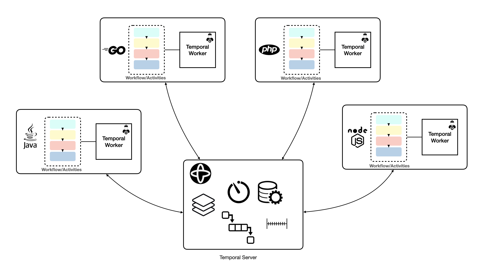

## Temporal Simple Polyglot example


<p align="center">

</p>


This demo uses the following Temporal SDKs:
* [Java](https://docs.temporal.io/docs/java/introduction)
* [Go](https://docs.temporal.io/docs/go/introduction)
* [PHP](https://docs.temporal.io/docs/php/introduction)
* [Node](https://docs.temporal.io/docs/node/introduction)

It shows interactions between Workflows and Activities written in different 
programming languages using the Temporal SDKs.

Interactions between workflows and activities:

1. Java Workflow signals Go Workflow (10 times)
2. Go Workflow signals Java Workflow (10 times)
3. Java Workflow invokes a Go Activity
4. Go Activity queries Java Workflow
5. Go Workflow invokes Java Activity
6. Java Activity queries Go Workflow
7. Java Workflow signals PHP Workflow
8. Go Workflow signals PHP Workflow
9. Java Workflow invokes NodeJS Activity and propagates its error 
10. Go Workflow invokes NodeJS Activity and propagates its error
11. PHP Wokflow invokes NodeJS Activity and propagates its error

### Running the demo

1) Start the Temporal Server:
```shell script
git clone https://github.com/temporalio/docker-compose.git
cd  docker-compose
docker compose up
```

Note: The sample apps in different languages should be started in 
the shown order. They should be started within 3 minutes from each other.
You can set different Workflow execution timeouts to change this if you wish.

2) Start the Node sample:
```shell script
cd app-node
npm install
npm start
```

"npm install" does not have to be run each time, only when changes are made.

3) Start the PHP sample:
```shell script
cd app-php
composer install
./rr serve
php app.php simple  
```

"composer install" does not have to be run each time.

4) Start the Go worker and starter:
```shell script
cd app-go
go run worker/main.go
go run starter/main.go
```

5) Start the Java worker and starter:
```shell script
cd app-java
mvn compile exec:java -Dexec.mainClass="org.simple.app.StartWorker"
mvn compile exec:java -Dexec.mainClass="org.simple.app.StartWorkflow"
```

### Seeing the results:
1) Look at the logs printed in the same window where you ran the Go workflow starter, you should ge:

```shell script
Workflow result: 
Hello from Java Workflow: 0
Hello from Java Workflow: 1
Hello from Java Workflow: 2
Hello from Java Workflow: 3
Hello from Java Workflow: 4
Hello from Java Workflow: 5
Hello from Java Workflow: 6
Hello from Java Workflow: 7
Hello from Java Workflow: 8
Hello from Java Workflow: 9
Java SimpleActivity - hello from: GoWorkflow Query result: This is a simple Go Workflow
Error from Node Activity: NodeJs Activity Error...
```

2) Look at the results of our Java workflow, you should get:
```shell script
Hello from Go workflow: 0
Hello from Go workflow: 1
Hello from Go workflow: 2
Hello from Go workflow: 3
Hello from Go workflow: 4
Hello from Go workflow: 5
Hello from Go workflow: 6
Hello from Go workflow: 7
Hello from Go workflow: 8
Hello from Go workflow: 9
Go Activity - hello from: JavaWorkflow Query result: This is a simple Java Workflow
Error from Node Activity: NodeJs Activity Error...
```

3) Look at the results of your PHP workflow, you should get:
```shell script
Result:
Hello from Java Workflow: 0
Hello from Java Workflow: 1
Hello from Java Workflow: 2
Hello from Java Workflow: 3
Hello from Java Workflow: 4
Hello from Java Workflow: 5
Hello from Java Workflow: 6
Hello from Java Workflow: 7
Hello from Java Workflow: 8
Hello from Java Workflow: 9
Hello from Go workflow: 0
Hello from Go workflow: 1
Hello from Go workflow: 2
Hello from Go workflow: 3
Hello from Go workflow: 4
Hello from Go workflow: 5
Hello from Go workflow: 6
Hello from Go workflow: 7
Hello from Go workflow: 8
Hello from Go workflow: 9
Error from Node Activity: NodeJs Activity Error...
```
